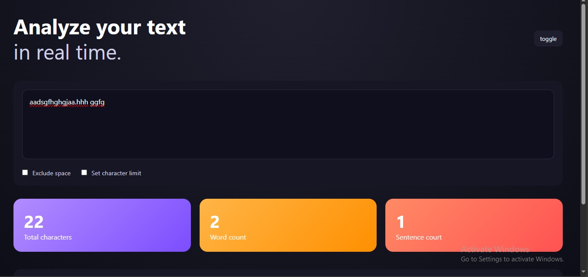

# TEXT-ANALYZER
# Text Analyzer App

A clean, responsive text analysis tool built with vanilla JavaScript, HTML, and CSS.

It analyzes text in real time and provides useful statistics such as character count, word count, sentence count, and letter frequency.

## ✨ Features

- Real-time text analysis
- Character count (with optional space exclusion)
- Word count
- Sentence count
- Most frequently used letter
- Dark / Light mode toggle
- Fully responsive layout

## 🛠 Built With

- HTML5
- CSS3 (Flexbox & Grid)
- Vanilla JavaScript (DOM manipulation)

## 📱 Responsive Design

The app adapts seamlessly to desktop, tablet, and mobile screens.

## 🚀 Live Demo

👉 https://saygathethirdd.github.io/text-analyzer/

## 📸 Screenshot

## 📚 What I Learned

- DOM manipulation and event handling
- State management using CSS classes
- Responsive layout using CSS Grid
- Theme toggling (dark / light mode)
- Writing cleaner, modular JavaScript

---

Feel free to fork or explore the code.
